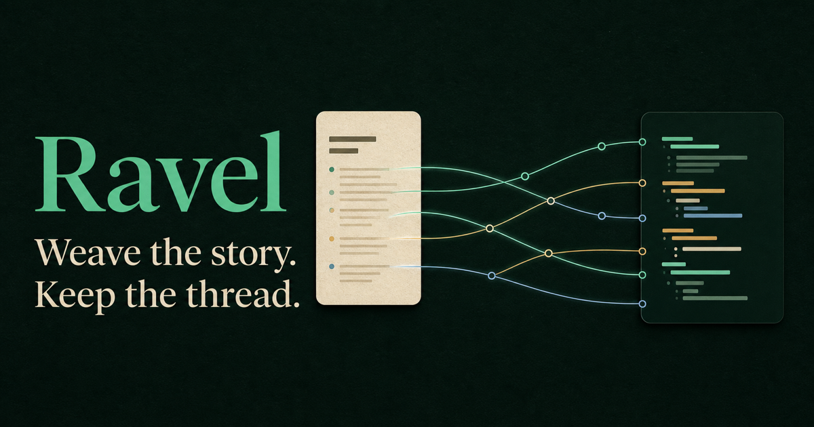

::: {.ravel-hero}
<h1 class="visually-hidden">Ravel — weave the story, keep the thread</h1>


::: {.hero-support}
::: {.hero-summary}
Ravel assembles named code pieces into finished artifacts while preserving the
dependency graph and provenance that explain exactly where every generated
range came from.

<p class="hero-note">Static by design · Browser-safe core · Source-linked diagnostics</p>
:::

::: {.hero-actions}
[Open the live playground](playground/){.btn .btn-primary .btn-lg}
[Get started](getting-started.md){.btn .btn-outline-light .btn-lg}
:::
:::
:::

::: {.feature-strip}
::: {.feature}
<span>01</span>

### Write in narrative order

Name fenced code chunks where they make sense in the explanation. Assembly
order stays explicit and independent.
:::

::: {.feature}
<span>02</span>

### Generate deterministically

The portable graph evaluator composes, transforms, and emits artifacts without
executing document JavaScript or shell commands.
:::

::: {.feature}
<span>03</span>

### Trace every range

Versioned provenance maps connect generated offsets back to exact or honestly
coarse source locations and derivation steps.
:::
:::

::: {.quickstart}
::: {.quickstart-copy}
<p class="hero-eyebrow">Five minutes to a woven file</p>

## Small surface. Explicit composition.

Ravel 0.1 focuses on dependable static weaving: Markdown fences become a
portable Ravel Map, the core resolves a graph, and hosts decide where artifacts
may be written.

[Read the five-minute guide](getting-started.md) or experiment without installing
anything in the [browser playground](playground/).
:::

````{.markdown filename="greeting.md"}
---
ravel:
  document: greeting
---

```javascript {.ravel #message}
const message = "Hello from Ravel";
```

```javascript {.ravel #main}
_"message.javascript"
console.log(message);
```

```ravel
out("dist/greeting.js", _"main.javascript")
```
````
:::
